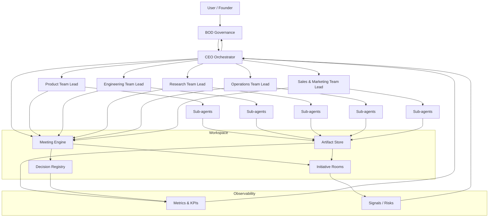

# DeamCompan Architecture Diagram

## Overview (Mid-level)

## Data & Decision Flow
- Governance sets strategy → CEO orchestrates → Team Leads execute with sub‑agents.
- Meetings generate decisions and action items stored as artifacts.
- Artifacts feed metrics and signals back up to the CEO and BOD.
